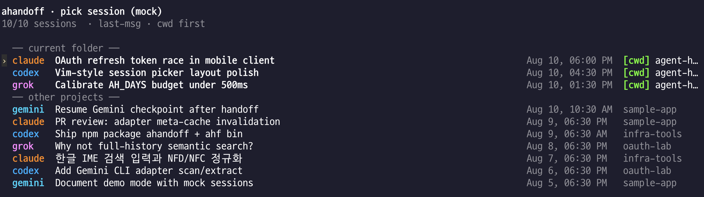

# ahandoff

**Language:** [English](README.md) · [한국어](README.ko.md)

[](https://www.npmjs.com/package/ahandoff)
[](https://www.npmjs.com/package/ahandoff)



Fast **recent-session handoff** across local coding agents.

- **npm:** [ahandoff](https://www.npmjs.com/package/ahandoff)
- **Command:** `ahf` (alias: `ahandoff`)
- **Agents:** Claude Code, Codex, Grok Build, Gemini CLI
- **Default window:** last **7 days** (tune with `--days` / `AH_DAYS`)
- **Scope:** all projects (default); **current cwd sessions listed first**
- **Always prints timing** so you can calibrate lookback for your machine

> Not a full-history semantic search tool.  
> This tool optimizes for: *“context filled up — continue in another agent now.”*

## Purpose and philosophy

`ahandoff` exists for **continuity, not retrieval**. Its job is to carry the work you are doing now into another coding agent when a context or token limit interrupts you. In that moment, the useful session is almost always one of the most recent ones—not an arbitrary conversation from months ago.

Limiting discovery to a recent window is therefore an intentional product boundary, not a missing search feature:

1. **Recent over exhaustive** — show the small set of sessions that are plausible handoff candidates.
2. **Fast and predictable over complete** — prune old files by mtime instead of indexing an entire history.
3. **Metadata before content** — keep listing lightweight; read full turns only after the user chooses a session to hop.
4. **One job, done well** — full-history indexing, semantic recall, and archival search belong to tools designed for finding past work.

`--days` and `AH_DAYS` let you match the recent window to your own workflow. They are not intended to turn `ahandoff` into an all-history search engine. If you need to rediscover older work, use a history-search tool; if you need to continue what you were just doing, use `ahandoff`.

## vs [agent-hop](https://github.com/hetpatel-11/agent-hop)

[agent-hop](https://github.com/hetpatel-11/agent-hop) is the broader tool: **search your entire local agent history** (hybrid / semantic search, embeddings, fuzzy match) and resume or convert any session. Great when you remember the *topic* but not which tool or folder held the chat.

**ahandoff** is a narrower, faster cut of that idea for a different moment:

| | **agent-hop** | **ahandoff** |
|---|---|---|
| **Job** | Find a session somewhere in full history | Hand off a **recent** session *now* |
| **Search** | Hybrid + semantic (ONNX embed, background index) | Lightweight title/path filter + recency |
| **Default window** | Full local history | Last **7 days** (`--days` / `AH_DAYS`) |
| **List cost** | Can open/index many sessions | **mtime prune** → never open old files |
| **Cache** | Vector index under `~/.agent-hop` | Tiny **meta cache** (path+mtime+size) |
| **Body / turns** | Needed for search quality | Loaded **only on hop** — list stays cheap |
| **Sort** | Search rank + recency | **cwd-first**, then recency (not cwd-only) |
| **Latency** | Varies with index / embed work | **Always prints timing**; `ahf bench` calibrates days |
| **Agent I/O** | Interactive + scriptable hop | Machine lines: `AH_TIMING`, `AH_CONVERT` on stderr |
| **Agents** | Claude, Codex, OpenCode, Pi, Grok | Claude, Codex, Grok, **Gemini** |

### What we improved for the “handoff now” path

1. **Speed-first pipeline** — scan candidates by mtime only, extract meta with a disk cache, parse full turns only when converting. Goal: sub-second list on a typical machine.
2. **Calibratable lookback** — `ahf bench --days 1,3,7,14` and budget hints (`AH_BUDGET_MS`) so you can pick a days window that stays under your latency budget.
3. **cwd-aware ranking** — current project sessions float to the top without hiding other projects (unless `--cwd-only`).
4. **Observable by design** — every list/hop emits human + machine timing so agents and humans can tune the same way.
5. **Vim-style picker** — `j/k`, `g/G`, Tab filter cycle, `/` search, Hangul key layout friendly — less wizard, more muscle memory.
6. **Gemini CLI** support for hop/resume (agent-hop focuses on OpenCode/Pi instead).

Use **agent-hop** when you need deep historical search. Use **ahandoff** when the session is recent and you need to switch tools immediately.

## Install

**Package on npm:** [https://www.npmjs.com/package/ahandoff](https://www.npmjs.com/package/ahandoff)

### Global install (recommended)

```bash
npm install -g ahandoff

# then use either binary name
ahf --help
ahandoff --help
```

Requires **Node.js ≥ 18**.

### One-off with `npx` (no install)

```bash
npx ahandoff
npx ahandoff list
npx ahandoff --mock
npx ahandoff hop -f claude -t codex --latest
```

`npx` downloads the package on first run and executes the `ahandoff` CLI. Good for trying the tool without a global install.

### From this repo (development)

```bash
# install deps, build, and link globally
npm install
npm run build
npm install -g .

# or link while iterating
npm run build && npm link
```

## Demo with mock data

Run the picker without scanning real agent sessions:

```bash
# after global install
ahf --mock
# or
AH_MOCK=1 ahf

# with npx
npx ahandoff --mock

# from this repo
just mock
```

## Usage

```bash
# interactive session list (vim-style picker)
ahf
# same as:
ahandoff
npx ahandoff

ahf list
npx ahandoff list

# calibrate days threshold for your machine
ahf bench --days 1,3,7,14

# handoff latest Claude session → Codex
ahf hop -f claude -t codex --latest
npx ahandoff hop -f claude -t codex --latest

# pick interactively then hop
ahf hop -f claude -t grok
ahf "oauth" -r codex
```

After a global install, `ahf` and `ahandoff` are equivalent. With `npx`, use the package name: `npx ahandoff …`.

### Picker keys (vim-friendly)

| Key | Action |
|---|---|
| `j` / `k` · `↑` / `↓` | move |
| `g` / `G` | top / bottom |
| `Tab` / `Shift-Tab` | cycle agent filter (`all` → claude → codex → grok → gemini) |
| `/` | search (Enter apply, Esc cancel) |
| `Enter` | select |
| `q` / `Esc` | quit |

Footer always shows the agent filter and shortcut hints.

### Timing output

Every `list` / `hop` prints machine- and human-readable timing on **stderr**:

```text
AH_TIMING elapsed_ms=187 days=7 sessions=6 candidates=48 cache_hit=42 cache_miss=6 scan_ms=112 extract_ms=71 ...
⏱  list ready in 187ms  (days=7, tools=claude,codex,grok,gemini)
   scan   112ms  candidates=48  parsed=6  cache_hit=42  cache_miss=6
   sessions: 6  (cwd first: 2)
```

- Agents: `rg '^AH_TIMING'` or env `AH_TIMING=1` / `--timing-json`
- If over budget (`AH_BUDGET_MS`, default 500), a `--days` hint is printed

### Env

| Var | Default | Meaning |
|---|---|---|
| `AH_DAYS` | `7` | default lookback |
| `AH_BUDGET_MS` | `500` | hint threshold |
| `AH_TIMING` | off | force timing JSON on stderr |

Meta cache: `~/.cache/ahandoff/meta-v1.json`

## Design notes

1. **mtime first** — files older than the window are never opened
2. **meta cache** — same path+mtime+size → skip re-parse
3. **body/full turns only on hop** — list stays cheap
4. **cwd-first sort**, not cwd-only filter (unless `--cwd-only`)
5. **Codex** prunes by `YYYY/MM/DD` directory; **Grok** lists via `summary.json` only

## Credits

Built with ideas and patterns from **[agent-hop](https://github.com/hetpatel-11/agent-hop)** by [hetpatel-11](https://github.com/hetpatel-11) — cross-agent session hop, adapters, and the “continue elsewhere” UX. Shoutout 🙌

## License

MIT
